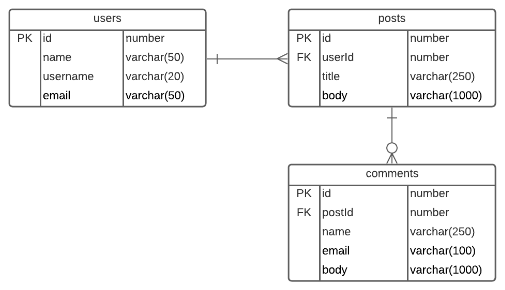

# awakelab-ensayo-periodico

## Problema

Un diario electrónico pone a disposición del público sus publicaciones y comentarios de estas, a fin de que se pueda replicar en otros medios, o bien para analítica de datos.

Para almacenar los datos que provee el medio, se ha diseñado el siguiente modelo de datos:

Las tablas anteriores y sus campos son los siguientes:
 * **users**: almacena los usuarios que realizan las publicaciones. Los campos de la tabla son un identificador, el nombre, el identificador de usuario y el correo electrónico.
 * **posts**: en esta tabla se almacenan las publicaciones. Los campos pertenecientes a estatabla son un identificador del registro, el identificador de usuario, el título de la publicación y el cuerpo o texto de la publicación.
 * **comments**: en esta tabla se almacenarán los comentarios de las publicaciones indicadas en el punto anterior. Los campos asociados a los comentarios son: un identificador, un identificador de la publicación, el título de la publicación, el correo electrónico de quien publica y el cuerpo o texto del comentario.

Para acceder a los datos, existen los siguientes servicios REST:

 * https://jsonplaceholder.typicode.com/posts: Permite obtener el listado de publicaciones en formato JSON
 * https://jsonplaceholder.typicode.com/comments: Permite obtener el listado de comentarios en formato JSON

Através del modelo anterior, se debe crear un sistema web compuesto por tres secciones:

 * **Carga de datos**: Se debe crear un controlador que permita cargar los datos de las tablas *"posts"* y *"comments"* desde los servicios antes mencionados. Dado que la carga es completa, antes de realizar el proceso debe procurar eliminar los registros de ambas tablas.
 * **Listado de publicaciones**: se debe crear un controlador para desplegar el listado depublicaciones. Debe mostrar el título, el nombre del usuario que la publicó y la cantidad de comentarios asociados a ella.
 * **Listado de comentarios**: se debe crear un controlador que despliegue los comentarios de una publicación. Este método debe recibir como parámetro en la URL el id de la publicación a analizar, y en base al mismo debe filtrar los comentarios. Se pide desplegar el campo identificador del comentario, el título o nombre de la publicación y el correo electrónico. Además,  se deben mostrar los primeros 20 caracteres del cuerpo del comentario.

## Requerimientos

 * El proyecto creado debe contar con un controlador de inicio que despliegue las secciones creadas.
 * El sistema debe ser construido utilizando el framework Spring MVC, conectándose a una base de datos Oracle 11g express.
 * Las vistas creadas las debe asociar por medio de vínculos HTML entre ellas, o bien por medio de un menú principal.
 * En las tablas no existen campos autoincrementales.
 * La revisión del problema se realizará en base al modelo antes planteado; no se permite agregar, modificar o quitar campos del modelo.
